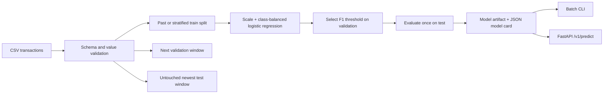

# Credit Card Fraud Detection

[](https://github.com/Mohamed-ahmed-shokry/Credit-Card-Fraud-Detection/actions/workflows/ci.yml)
[](https://github.com/Mohamed-ahmed-shokry/Credit-Card-Fraud-Detection/releases)
[](https://www.python.org/)
[](LICENSE)

A reproducible, leakage-safe credit-card fraud detection system with a tested
training pipeline, tuned decision threshold, batch CLI, versioned HTTP API, model
metadata, and hardened container deployment.

The project works with the common anonymized credit-card dataset schema
(`Time`, `V1`…`V28`, `Amount`, `Class`) and with any all-numeric feature set whose
binary target contains exactly `0` (legitimate) and `1` (fraud).

## Why this project is different

- **Honest evaluation:** stratified or chronological train, validation, and untouched
  test splits.
- **Imbalance-aware decisions:** class-balanced logistic regression and a threshold
  selected on validation F1 or weighted business cost—not a hard-coded `0.5`.
- **Relevant metrics:** average precision, ROC AUC, precision, recall, F1, balanced
  accuracy, Brier score, and the complete confusion matrix.
- **Probability calibration:** three-fold sigmoid calibration is fitted inside the
  training split before validation threshold selection.
- **Reproducible artifacts:** dataset fingerprint, dependency version, split sizes,
  configuration, metrics, threshold, and feature contract travel with the model.
- **Safe inference boundary:** missing, extra, non-numeric, null, and infinite
  features fail with actionable errors.
- **Two serving modes:** batch CSV scoring through the CLI and bounded online batches
  through FastAPI.
- **Quality gates:** formatting, linting, strict type checking, branch coverage of at
  least 97%, package builds, and Python 3.12/3.14 CI.

## Architecture



## Quick start

Python 3.12 or newer is required.

```bash
python -m venv .venv
```

On Linux or macOS:

```bash
source .venv/bin/activate
python -m pip install -e ".[dev]"
```

On PowerShell:

```powershell
.\.venv\Scripts\Activate.ps1
python -m pip install -e ".[dev]"
```

Run the complete workflow without downloading private data:

```bash
fraud-detect generate-data --output data/demo.csv --rows 5000
fraud-detect train data/demo.csv --output artifacts/model
fraud-detect inspect artifacts/model
fraud-detect explain artifacts/model --top 10
fraud-detect drift artifacts/model data/demo.csv
fraud-detect predict artifacts/model data/demo.csv --output predictions.csv
```

Synthetic data exists for demos and smoke tests only. It must not be used to claim
real-world model performance.

## Explain individual predictions

Show per-transaction feature contributions to understand why a specific transaction
was scored as fraud or legitimate:

```bash
fraud-detect predict artifacts/model data/demo.csv --output predictions.csv --explain
```

The output CSV will include `contrib_<feature>` columns showing each feature's
contribution to the fraud score. For logistic regression, contributions are
standardized coefficients multiplied by the scaled feature values. For random
forest, a simplified approximation based on feature importance is used.

Via the API, include `"explain": true` in the request body to receive
`contributions` in each prediction:

```bash
curl -X POST http://localhost:8000/v1/predict \
  -H "Content-Type: application/json" \
  -d '{
    "transactions": [{"Time": 12345.0, "V1": -1.2, ...}],
    "explain": true
  }'
```

## Train on the anonymized dataset

Place the downloaded CSV under the ignored `Dataset/` directory; raw financial data
must never be committed.

```bash
fraud-detect train Dataset/creditcard.csv --output artifacts/model
```

Training refuses to replace a non-empty artifact directory. Pass `--overwrite` only
after confirming the existing model can be replaced.

The default estimator is class-balanced logistic regression: interpretable and
well-calibrated. Opt-in random forest and histogram gradient boosting models are
available for callers who have validated them against the baseline on their own
data; they share the same leakage-safe split, calibration, and
threshold-selection pipeline:

```bash
fraud-detect train Dataset/creditcard.csv \
  --output artifacts/model \
  --estimator random_forest
fraud-detect train Dataset/creditcard.csv \
  --output artifacts/model \
  --estimator hist_gradient_boosting \
  --learning-rate 0.05 \
  --max-depth 5
```

Tree hyperparameters are settable on `train`: `--regularization` and
`--max-iterations` for logistic regression, `--n-estimators` and `--max-depth`
for random forest, and `--max-iterations`, `--learning-rate`,
`--l2-regularization`, `--max-bins`, plus `--max-depth` for histogram gradient
boosting.

`explain` reports feature importances instead of standardized coefficients for
tree models: non-negative magnitudes with no `direction`, unlike the signed
coefficients a logistic regression reports. Random forest uses native
importances; histogram gradient boosting uses deterministic training-data
permutation importance (the pinned scikit-learn runtime exposes no native
importance for it). The model card's `feature_effects` entries record which
kind of value they hold in a `method` field.

Gather the evidence for that choice before committing to it. `compare` trains
every estimator (or a specific subset) on the exact same split and reports
validation and test metrics side by side without saving anything:

```bash
fraud-detect compare Dataset/creditcard.csv
fraud-detect compare Dataset/creditcard.csv --estimator logistic_regression
```

To compare hyperparameters within one estimator on that same split, sweep a
single allow-listed parameter (the parameter must apply to the chosen
estimator):

```bash
fraud-detect compare Dataset/creditcard.csv \
  --estimator random_forest \
  --param-name n_estimators \
  --param-values 50,100,200
```

The default split is reproducible and stratified. When the data includes transaction
order, evaluate chronologically to train on the past and test on the newest window:

```bash
fraud-detect train Dataset/creditcard.csv \
  --output artifacts/model \
  --split-strategy temporal \
  --time-column Time
```

Chronological training records each split's minimum and maximum time in the model
card. Every window must contain legitimate and fraudulent examples; otherwise
training stops with an actionable error rather than publishing invalid metrics.

To minimize an explicit business-cost policy on validation data:

```bash
fraud-detect train Dataset/creditcard.csv \
  --output artifacts/model \
  --threshold-strategy cost \
  --false-positive-cost 1 \
  --false-negative-cost 25
```

The costs are relative weights, not currency. For example, `25` says a missed fraud
is treated as costly as 25 false alerts. The chosen policy and holdout expected cost
per transaction are persisted in `metadata.json`.

Scores use three-fold sigmoid calibration by default. Larger representative datasets
can opt into isotonic calibration, while `none` exposes the underlying classifier
scores:

```bash
fraud-detect train Dataset/creditcard.csv \
  --calibration-method isotonic \
  --calibration-folds 5
```

Calibration is learned only from training folds. Brier score is reported on
validation and untouched test data; lower is better. Calibration improves probability
interpretation but cannot correct unrepresentative or shifted data.

Calibration folds use one worker by default to avoid multiplying memory use,
especially on Windows. A resource-controlled training host can opt into all
processors explicitly:

```bash
fraud-detect train Dataset/creditcard.csv --calibration-jobs -1
```

Training writes:

```text
artifacts/model/
├── manifest.json   # SHA-256 integrity hashes for the artifact files
├── metadata.json   # readable model card, metrics, fingerprint, and schema
└── model.joblib    # fitted preprocessing/model pipeline and threshold
```

Model cards record the Python, joblib, NumPy, pandas, scikit-learn, and SciPy
versions used for training. The loader requires the recorded scikit-learn version
to exactly match the serving runtime. Cross-version pickle/joblib loading is
unsupported; retrain the model after dependency upgrades instead of bypassing this
check.

Use a different target name when needed:

```bash
fraud-detect train transactions.csv --target is_fraud --output artifacts/model
```

Every feature column must be numeric and finite. The target must contain both `0`
and `1`, with enough examples of each class for all three stratified splits.

## Explain global feature effects

Show the strongest global feature effects:

```bash
fraud-detect explain artifacts/model --top 10
```

The report ranks features by absolute magnitude. For the default logistic
regression, that is a standardized coefficient, and each entry labels whether
increasing the feature is associated with higher or lower fraud risk. For tree
models, it is a non-negative importance with no direction: native importances
for random forest, and training-data permutation importance for histogram
gradient boosting. Each entry's `method` field says which kind of value it
holds. For calibrated models, values are averaged across the fitted
calibration folds.

These are global associations, not causal claims or explanations of an individual
transaction. In the common anonymized dataset, `V1`…`V28` are transformed components,
so their operational interpretation is intentionally limited.

## Serve predictions

Run the service directly:

```bash
fraud-detect serve artifacts/model --host 0.0.0.0 --port 8000
```

Interactive OpenAPI documentation is available at `http://localhost:8000/docs`,
readiness at `GET /health`, and Prometheus metrics at `GET /metrics`.

Score one or more transactions (all trained features are required):

```bash
curl -X POST http://localhost:8000/v1/predict \
  -H "Content-Type: application/json" \
  -d '{
    "transactions": [
      {
        "Time": 12345.0,
        "V1": -1.2,
        "V2": 0.4,
        "V3": 0.1,
        "V4": 0.2,
        "V5": 0.3,
        "V6": 0.0,
        "V7": -0.2,
        "V8": 0.1,
        "V9": 0.0,
        "V10": -0.4,
        "V11": 0.1,
        "V12": 0.2,
        "V13": 0.0,
        "V14": -0.1,
        "V15": 0.3,
        "V16": 0.0,
        "V17": -0.2,
        "V18": 0.1,
        "V19": 0.0,
        "V20": 0.2,
        "V21": 0.1,
        "V22": 0.0,
        "V23": -0.1,
        "V24": 0.1,
        "V25": 0.2,
        "V26": 0.0,
        "V27": -0.1,
        "V28": 0.0,
        "Amount": 49.99
      }
    ]
  }'
```

Example response:

```json
{
  "model_version": "71dcb1da2d78",
  "threshold": 0.73,
  "predictions": [
    {
      "fraud_probability": 0.18,
      "is_fraud": false
    }
  ]
}
```

To receive per-transaction feature contributions, include `"explain": true`:

```bash
curl -X POST http://localhost:8000/v1/predict \
  -H "Content-Type: application/json" \
  -d '{
    "transactions": [{"Time": 12345.0, "V1": -1.2, ...}],
    "explain": true
  }'
```

Response with explanations:

```json
{
  "model_version": "71dcb1da2d78",
  "threshold": 0.73,
  "predictions": [
    {
      "fraud_probability": 0.18,
      "is_fraud": false,
      "contributions": {
        "Time": 0.001,
        "V1": -0.045,
        "V2": 0.012,
        "Amount": 0.003
      }
    }
  ]
}
```

The service accepts at most 1,000 transactions and 2 MiB of request body data per
request. Both declared and streamed/chunked oversized bodies receive `413` before
schema validation.
Feature values must be finite JSON numbers; numeric strings and booleans are not
coerced. Validation errors describe the failing location and rule without echoing
the submitted transaction value.

Every HTTP response includes:

- `X-Request-ID`, which propagates a safe caller-supplied identifier or generates one;
- `X-Process-Time-Ms`, the server-side request duration.

Completion and failure logs carry the same request ID for correlation. Request IDs
are operational labels only and must not contain cardholder or personal data.

`GET /metrics` reports Prometheus-format counters and a histogram: total requests
and request duration labeled by method, path, and status code, plus total scored
transactions labeled by decision. Restrict it to a trusted scrape network like any
other operational endpoint; it carries counts and labels only, never transaction
values.

### Optional API key authentication

Enable API key validation by configuring the `api_keys` parameter when creating the
FastAPI app. This is a reference implementation for defense in depth—not a
substitute for a proper authentication layer at the gateway level.

```python
from fraud_detection.api import create_app
from fraud_detection.model import load_model

model = load_model("artifacts/model")
app = create_app(model=model, api_keys=["your-secret-key-1", "your-secret-key-2"])
```

Clients must include the `X-API-Key` header:

```bash
curl -X POST http://localhost:8000/v1/predict \
  -H "Content-Type: application/json" \
  -H "X-API-Key: your-secret-key-1" \
  -d '{"transactions": [...]}'
```

Invalid or missing keys return `401 Unauthorized`.

### Optional rate limiting

Enable per-client-IP rate limiting with the `rate_limit_requests` and
`rate_limit_window_seconds` parameters. This is a reference implementation using
an in-memory fixed-window algorithm—not a substitute for a proper rate limiter at
the gateway level.

```python
app = create_app(
    model=model,
    rate_limit_requests=100,
    rate_limit_window_seconds=60.0,  # 100 requests per minute per IP
)
```

Excess requests return `429 Too Many Requests`.

## Monitor feature drift

Compare recent transactions with the training distribution:

```bash
fraud-detect drift artifacts/model recent_transactions.csv \
  --output reports/drift.json
```

Existing report files are protected by default; pass `--overwrite` only after
confirming the report can be replaced. Generated datasets, prediction CSVs, and
drift reports use same-directory atomic replacement so a failed write does not
truncate the previous output.

The report ranks every feature by Population Stability Index (PSI):

- `stable`: PSI below `0.10`
- `warning`: PSI from `0.10` to below `0.25`
- `drifted`: PSI `0.25` or higher

These cutoffs are persisted in each model card (`drift_thresholds`) so reports
share one source of truth; artifacts trained before they were persisted fall
back to the same reference defaults.

PSI is a diagnostic signal, not proof that model quality changed. Investigate alerts
alongside label-based performance, calibration, traffic changes, and business context.
Malformed reference profiles are rejected before PSI calculation, including invalid
bin ordering, proportions, feature names, and non-finite statistics.

## Check probability calibration

Judge whether predicted probabilities mean what they say on held-out labeled
data (never the threshold-tuning validation split):

```bash
fraud-detect calibration artifacts/model heldout_transactions.csv \
  --output reports/calibration.json
```

The report bins predictions into equal-width reliability bins and reports the
expected and maximum calibration errors plus a Brier-score decomposition
(reliability, resolution, uncertainty). Lower Brier score, calibration errors,
and reliability are better; higher resolution is better. A well-calibrated
model still needs representative, unshifted data — see drift monitoring above.

## Benchmark batch scoring

Time offline batch scoring on this host for capacity planning:

```bash
fraud-detect benchmark artifacts/model data/demo.csv \
  --batch-sizes 1,10,100,1000 \
  --output reports/benchmark.json
```

The report gives median latency and throughput per batch size. It measures this
host only; production throughput also depends on the serving stack,
concurrency, and hardware.

## Container deployment

Train the model on the host first, then mount it read-only:

```bash
fraud-detect train Dataset/creditcard.csv --output artifacts/model
docker compose up --build
```

The container runs as an unprivileged user with a read-only root filesystem, no
Linux capabilities, and `no-new-privileges`. The model is supplied through the
read-only `./artifacts/model` volume.

## Development

Run the same gates used in CI:

```bash
python -m ruff format --check src tests
python -m ruff check src tests
python -m mypy src
python -m pip_audit --skip-editable
python -m pytest --cov=fraud_detection --cov-report=term-missing
python -m build
python -m twine check dist/*
```

Project layout:

```text
src/fraud_detection/
├── api.py          # versioned online prediction service
├── cli.py          # training, comparison, scoring, explanation, drift, calibration, benchmarking, and serving
├── data.py         # ingestion, schema validation, and synthetic data
├── drift.py        # training profiles and PSI drift reporting
├── evaluation.py   # threshold tuning, imbalance-aware metrics, and calibration reports
└── model.py        # training, model card, inference, and persistence
tests/              # unit, integration, CLI, and API tests
```

## Responsible use and limitations

This is a reference implementation, not an autonomous financial decision-maker.
Real deployments need representative temporal data, validated business-cost inputs,
monitoring for data/concept drift, ongoing calibration analysis, access controls, audit
logging, incident response, and human review for consequential decisions.

The anonymized public dataset does not represent every geography, merchant type,
attack pattern, or future fraud strategy. A good holdout score does not prove
production performance.

Joblib uses Python pickle semantics and can execute code during loading. **Only load
model artifacts produced by a trusted training process.**

## Roadmap

See [ROADMAP.md](ROADMAP.md) for what's planned beyond `v0.1.0`, including
alternative estimators, PyPI publishing, and optional reference hardening
patterns.

## License

Released under the [MIT License](LICENSE).
