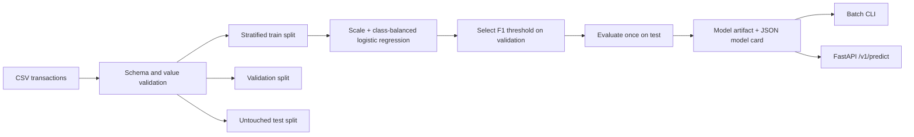

# Credit Card Fraud Detection

[](https://github.com/Mohamed-ahmed-shokry/Credit-Card-Fraud-Detection/actions/workflows/ci.yml)
[](https://www.python.org/)
[](LICENSE)

A reproducible, leakage-safe credit-card fraud detection system with a tested
training pipeline, tuned decision threshold, batch CLI, versioned HTTP API, model
metadata, and hardened container deployment.

The project works with the common anonymized credit-card dataset schema
(`Time`, `V1`…`V28`, `Amount`, `Class`) and with any all-numeric feature set whose
binary target contains exactly `0` (legitimate) and `1` (fraud).

## Why this project is different

- **Honest evaluation:** stratified train, validation, and untouched test splits.
- **Imbalance-aware decisions:** class-balanced logistic regression and a threshold
  selected on validation F1 or weighted business cost—not a hard-coded `0.5`.
- **Relevant metrics:** average precision, ROC AUC, precision, recall, F1, balanced
  accuracy, Brier score, and the complete confusion matrix.
- **Probability calibration:** three-fold sigmoid calibration is fitted inside the
  training split before validation threshold selection.
- **Reproducible artifacts:** dataset fingerprint, dependency version, split sizes,
  configuration, metrics, threshold, and feature contract travel with the model.
- **Safe inference boundary:** missing, extra, non-numeric, null, and infinite
  features fail with actionable errors.
- **Two serving modes:** batch CSV scoring through the CLI and bounded online batches
  through FastAPI.
- **Quality gates:** formatting, linting, strict type checking, branch coverage of at
  least 90%, package builds, and Python 3.12/3.14 CI.

## Architecture



## Quick start

Python 3.12 or newer is required.

```bash
python -m venv .venv
```

On Linux or macOS:

```bash
source .venv/bin/activate
python -m pip install -e ".[dev]"
```

On PowerShell:

```powershell
.\.venv\Scripts\Activate.ps1
python -m pip install -e ".[dev]"
```

Run the complete workflow without downloading private data:

```bash
fraud-detect generate-data --output data/demo.csv --rows 5000
fraud-detect train data/demo.csv --output artifacts/model
fraud-detect inspect artifacts/model
fraud-detect explain artifacts/model --top 10
fraud-detect drift artifacts/model data/demo.csv
fraud-detect predict artifacts/model data/demo.csv --output predictions.csv
```

Synthetic data exists for demos and smoke tests only. It must not be used to claim
real-world model performance.

## Train on the anonymized dataset

Place the downloaded CSV under the ignored `Dataset/` directory; raw financial data
must never be committed.

```bash
fraud-detect train Dataset/creditcard.csv --output artifacts/model
```

To minimize an explicit business-cost policy on validation data:

```bash
fraud-detect train Dataset/creditcard.csv \
  --output artifacts/model \
  --threshold-strategy cost \
  --false-positive-cost 1 \
  --false-negative-cost 25
```

The costs are relative weights, not currency. For example, `25` says a missed fraud
is treated as costly as 25 false alerts. The chosen policy and holdout expected cost
per transaction are persisted in `metadata.json`.

Scores use three-fold sigmoid calibration by default. Larger representative datasets
can opt into isotonic calibration, while `none` exposes the underlying classifier
scores:

```bash
fraud-detect train Dataset/creditcard.csv \
  --calibration-method isotonic \
  --calibration-folds 5
```

Calibration is learned only from training folds. Brier score is reported on
validation and untouched test data; lower is better. Calibration improves probability
interpretation but cannot correct unrepresentative or shifted data.

Training writes:

```text
artifacts/model/
├── manifest.json   # SHA-256 integrity hashes for the artifact files
├── metadata.json   # readable model card, metrics, fingerprint, and schema
└── model.joblib    # fitted preprocessing/model pipeline and threshold
```

Use a different target name when needed:

```bash
fraud-detect train transactions.csv --target is_fraud --output artifacts/model
```

Every feature column must be numeric and finite. The target must contain both `0`
and `1`, with enough examples of each class for all three stratified splits.

## Explain global feature effects

Show the strongest standardized logistic-regression effects:

```bash
fraud-detect explain artifacts/model --top 10
```

The report ranks coefficients by absolute magnitude and labels whether increasing a
feature is associated with higher or lower fraud risk. For calibrated models,
coefficients are averaged across the fitted calibration folds.

These are global associations, not causal claims or explanations of an individual
transaction. In the common anonymized dataset, `V1`…`V28` are transformed components,
so their operational interpretation is intentionally limited.

## Serve predictions

Run the service directly:

```bash
fraud-detect serve artifacts/model --host 0.0.0.0 --port 8000
```

Interactive OpenAPI documentation is available at
`http://localhost:8000/docs`, and readiness at `GET /health`.

Score one or more transactions (all trained features are required):

```bash
curl -X POST http://localhost:8000/v1/predict \
  -H "Content-Type: application/json" \
  -d '{
    "transactions": [
      {
        "Time": 12345.0,
        "V1": -1.2,
        "V2": 0.4,
        "V3": 0.1,
        "V4": 0.2,
        "V5": 0.3,
        "V6": 0.0,
        "V7": -0.2,
        "V8": 0.1,
        "V9": 0.0,
        "V10": -0.4,
        "V11": 0.1,
        "V12": 0.2,
        "V13": 0.0,
        "V14": -0.1,
        "V15": 0.3,
        "V16": 0.0,
        "V17": -0.2,
        "V18": 0.1,
        "V19": 0.0,
        "V20": 0.2,
        "V21": 0.1,
        "V22": 0.0,
        "V23": -0.1,
        "V24": 0.1,
        "V25": 0.2,
        "V26": 0.0,
        "V27": -0.1,
        "V28": 0.0,
        "Amount": 49.99
      }
    ]
  }'
```

Example response:

```json
{
  "model_version": "71dcb1da2d78",
  "threshold": 0.73,
  "predictions": [
    {
      "fraud_probability": 0.18,
      "is_fraud": false
    }
  ]
}
```

The service accepts at most 1,000 transactions per request.

## Monitor feature drift

Compare recent transactions with the training distribution:

```bash
fraud-detect drift artifacts/model recent_transactions.csv \
  --output reports/drift.json
```

The report ranks every feature by Population Stability Index (PSI):

- `stable`: PSI below `0.10`
- `warning`: PSI from `0.10` to below `0.25`
- `drifted`: PSI `0.25` or higher

PSI is a diagnostic signal, not proof that model quality changed. Investigate alerts
alongside label-based performance, calibration, traffic changes, and business context.

## Container deployment

Train the model on the host first, then mount it read-only:

```bash
fraud-detect train Dataset/creditcard.csv --output artifacts/model
docker compose up --build
```

The container runs as an unprivileged user with a read-only root filesystem, no
Linux capabilities, and `no-new-privileges`. The model is supplied through the
read-only `./artifacts/model` volume.

## Development

Run the same gates used in CI:

```bash
python -m ruff format --check src tests
python -m ruff check src tests
python -m mypy src
python -m pytest --cov=fraud_detection --cov-report=term-missing
python -m build
```

Project layout:

```text
src/fraud_detection/
├── api.py          # versioned online prediction service
├── cli.py          # training, scoring, explanation, drift, and serving workflows
├── data.py         # ingestion, schema validation, and synthetic data
├── drift.py        # training profiles and PSI drift reporting
├── evaluation.py   # threshold tuning and imbalance-aware metrics
└── model.py        # training, model card, inference, and persistence
tests/              # unit, integration, CLI, and API tests
```

## Responsible use and limitations

This is a reference implementation, not an autonomous financial decision-maker.
Real deployments need representative temporal data, validated business-cost inputs,
monitoring for data/concept drift, ongoing calibration analysis, access controls, audit
logging, incident response, and human review for consequential decisions.

The anonymized public dataset does not represent every geography, merchant type,
attack pattern, or future fraud strategy. A good holdout score does not prove
production performance.

Joblib uses Python pickle semantics and can execute code during loading. **Only load
model artifacts produced by a trusted training process.**

## License

Released under the [MIT License](LICENSE).
